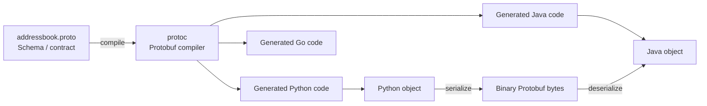
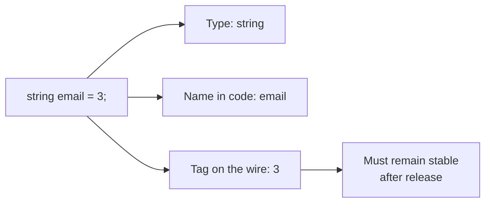
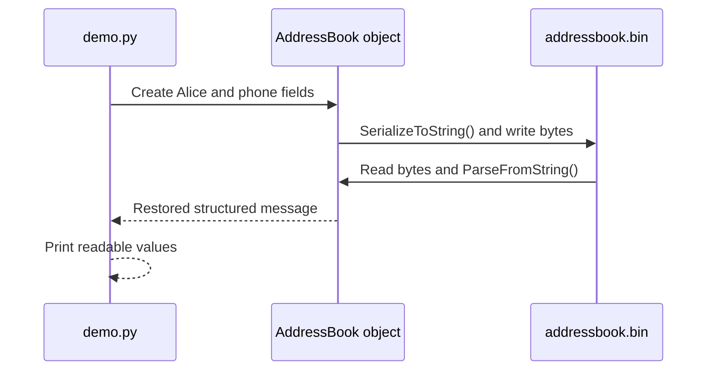
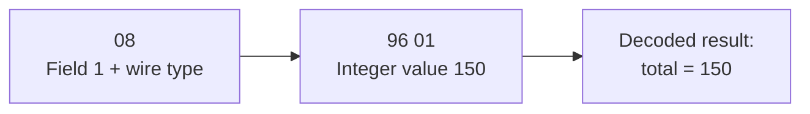
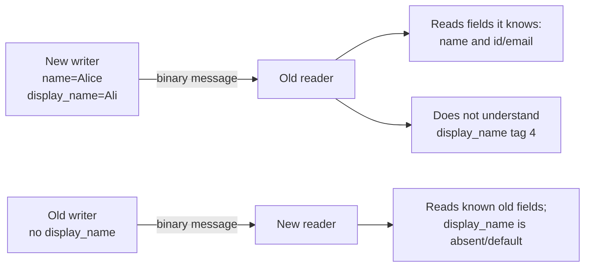
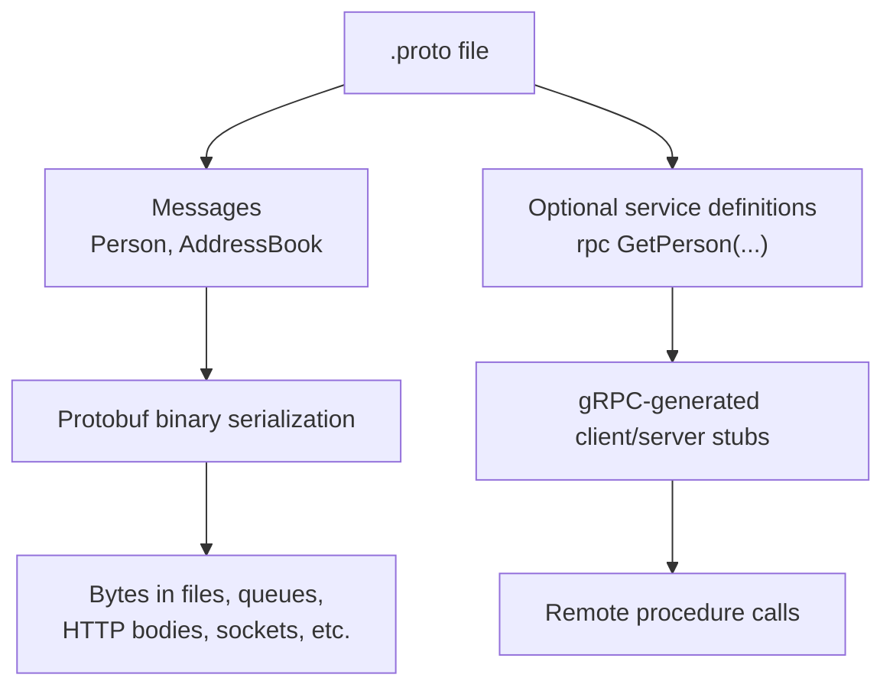
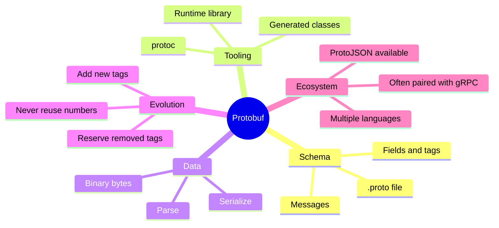

## Protocol Buffers (Protobuf)

Protocol Buffers, usually shortened to **Protobuf**, are a way to describe structured data once and then encode that data into a compact binary form.

A simple way to think about them is:

> A `.proto` file is a shared contract. It says what data exists, what type each value has, and which numbered tag represents it on the wire.

That contract can be used by programs written in different languages. A Python service can send a Protobuf message that a Java, Go, C++, or Kotlin service can read, as long as both know the same schema.

Protobuf is especially useful when data must be:

- exchanged between services;
- stored efficiently;
- read by more than one programming language; or
- evolved over time without breaking old clients.

It is not automatically the best format for every job. JSON is often easier to inspect by hand, while Protobuf is usually a better fit when compact messages, clear contracts, and compatibility matter.

### The big picture

With JSON, a program may send field names such as `"name"` and `"email"` in every message. With Protobuf, the field names and types are described in the schema, and the serialized message mainly carries compact field numbers and values.



The usual workflow is:

1. Write a `.proto` schema.
2. Run the Protobuf compiler, `protoc`.
3. Import the generated classes into your application.
4. Create normal in-memory message objects.
5. Serialize those objects to bytes for storage or network transfer.
6. Parse the bytes back into message objects later.

The binary data is not designed to be readable by a person in a text editor. The schema and generated classes make it meaningful.

### The four pieces to remember

| Piece | What it is | Why it matters |
|---|---|---|
| `.proto` file | The schema that defines messages and fields | It is the contract shared by producers and consumers |
| `protoc` | The compiler for schema files | It generates language-specific code |
| Generated classes | Classes such as `Person` or `AddressBook` | Your application uses these rather than manually encoding bytes |
| Binary message | Serialized data sent or stored | It is compact and can be parsed using the schema |

A Protobuf schema describes **message types**. A message is similar to a record, data class, or plain object: it groups related fields together.

### A first schema: an address book

Create a file named `addressbook.proto`:

```protobuf
syntax = "proto3";

package contacts;

enum PhoneType {
  PHONE_TYPE_UNSPECIFIED = 0;
  PHONE_TYPE_MOBILE = 1;
  PHONE_TYPE_HOME = 2;
  PHONE_TYPE_WORK = 3;
}

message PhoneNumber {
  string number = 1;
  PhoneType type = 2;
}

message Person {
  string name = 1;
  int32 id = 2;
  string email = 3;
  repeated PhoneNumber phones = 4;
}

message AddressBook {
  repeated Person people = 1;
}
```

Reading this schema in ordinary language:

- An `AddressBook` contains zero or more people.
- A `Person` has a name, numeric ID, email address, and zero or more phone numbers.
- A `PhoneNumber` has the actual number and a controlled phone type.
- `PhoneType` avoids free-form values such as `"cell"`, `"mobile phone"`, or `"Mobile"` all meaning the same thing.

#### What do the numbers mean?

In this line:

```protobuf
string email = 3;
```

- `string` is the value type.
- `email` is the field name used in code.
- `3` is the **field number**, also called the **tag**.

The field number is a permanent identity for that field in the binary format. Once a message type is in use, do not change the tag for an existing field and do not reuse an old tag for a new meaning.



Tags `1` to `15` are useful for frequently present fields because their keys can be encoded especially compactly.

#### Common field forms

A beginner can read most schemas by recognizing a few patterns:

```protobuf
message Example {
  string title = 1;                   // One text value
  int32 count = 2;                    // One integer value
  bool active = 3;                    // true or false
  repeated string labels = 4;         // A list of strings
  optional string nickname = 5;       // Presence can be checked
  map<string, string> metadata = 6;   // Key-value pairs
}
```

Useful concepts:

| Form | Meaning | Example use |
|---|---|---|
| Scalar field | A single primitive value | `string name = 1;` |
| Nested message | A structured value inside another message | `PhoneNumber` inside a person |
| `repeated` | A list of values | A person's phone numbers |
| `enum` | One value from a named set | Mobile, home, or work |
| `optional` | Tracks whether a scalar value was explicitly provided | Distinguishing “not supplied” from an empty string |
| `map` | Key-value collection | Labels or metadata |
| `oneof` | Exactly one of several alternatives may be set | Contact by email *or* phone |

A helpful rule is to model the data you mean, not the output format you hope to see. If the concept is a list, model it as `repeated`; if only one alternative makes sense at a time, consider `oneof`.

#### Worked example in Python

This example creates an address book, writes it as Protobuf bytes, reads it back, and prints the restored data.

### Step 1: Generate Python code

From the folder containing `addressbook.proto`, run:

```bash
protoc -I=. --python_out=. addressbook.proto
```

This generates a Python module named:

```text
addressbook_pb2.py
```

Your application imports this generated module. You generally do **not** edit generated code manually; edit the `.proto` file and compile again when the schema changes.

#### Use the generated messages

Create `demo.py`:

```python
from pathlib import Path

import addressbook_pb2 as pb


def create_address_book() -> pb.AddressBook:
    book = pb.AddressBook()

    alice = book.people.add()
    alice.id = 101
    alice.name = "Alice Nguyen"
    alice.email = "alice@example.com"

    mobile = alice.phones.add()
    mobile.number = "+49 30 555 1234"
    mobile.type = pb.PHONE_TYPE_MOBILE

    return book


def save_book(book: pb.AddressBook, filename: str) -> None:
    Path(filename).write_bytes(book.SerializeToString())


def load_book(filename: str) -> pb.AddressBook:
    book = pb.AddressBook()
    book.ParseFromString(Path(filename).read_bytes())
    return book


def print_book(book: pb.AddressBook) -> None:
    for person in book.people:
        print(f"{person.id}: {person.name} <{person.email}>")
        for phone in person.phones:
            kind = pb.PhoneType.Name(phone.type)
            print(f"  {kind}: {phone.number}")


if __name__ == "__main__":
    filename = "addressbook.bin"

    original = create_address_book()
    save_book(original, filename)
    print(f"Wrote {filename}")

    restored = load_book(filename)
    print_book(restored)
```

#### Run it

```bash
python demo.py
```

Expected output

```text
Wrote addressbook.bin
101: Alice Nguyen <alice@example.com>
  PHONE_TYPE_MOBILE: +49 30 555 1234
```

What happened?



The file `addressbook.bin` contains bytes, not Python code and not human-friendly text. The generated class knows how to translate between those bytes and the `AddressBook` structure.

### What is actually stored on the wire?

Most developers do not need to memorize the binary encoding, but understanding the idea explains why field numbers matter.

Consider this tiny schema:

```protobuf
syntax = "proto3";

message Counter {
  int32 total = 1;
}
```

If `total` is set to `150`, the encoded message is three bytes:

```text
08 96 01
```

Conceptually:



A serialized message is made of field records. Each record includes:

- the field number;
- enough information to tell the parser how the value is encoded; and
- the value itself.

Small integer values are commonly encoded using **varints**, where smaller numbers take fewer bytes. Field names such as `total` or `email` are not repeated in ordinary binary messages; the receiving program uses the schema to understand tag `1`, tag `2`, and so on.

This is why changing a tag can be dangerous: a reader may interpret old bytes as a completely different field.

### Safe schema evolution

One of Protobuf's strongest benefits is that a schema can grow as software evolves. That only works when the field-number rules are respected.

### Adding a field

Version 1:

```protobuf
message Person {
  string name = 1;
  int32 id = 2;
  string email = 3;
}
```

Version 2 adds a field with a new tag:

```protobuf
message Person {
  string name = 1;
  int32 id = 2;
  string email = 3;
  string display_name = 4;
}
```

This is the normal safe direction: old fields keep their original tags, and new information receives a new unused tag.



#### Removing a field

Suppose `email = 3` is no longer used. Do not assign tag `3` to another field later. Reserve both the number and, where useful, the old name:

```protobuf
message Person {
  reserved 3;
  reserved "email";

  string name = 1;
  int32 id = 2;
  string display_name = 4;
}
```

This helps the compiler prevent accidental reuse.

#### Changes to treat carefully

| Change | General guidance | Why |
|---|---|---|
| Add a new field using a new tag | Usually safe | Older readers can ignore data they do not recognize |
| Remove a field and reserve its number/name | Safe practice | Prevents accidental reuse |
| Rename a field while keeping its tag | Binary wire format can remain compatible, but check JSON/API consumers | Field names matter outside binary encoding |
| Change an existing tag number | Do not do this after release | Old and new messages disagree about meaning |
| Reuse a deleted field number | Do not do this | Old data may be decoded incorrectly |
| Change `repeated` to a scalar field | Avoid | Values can be lost or misread |
| Move fields into or out of a `oneof` | Review carefully | Presence and interpretation rules can change |

A useful habit is to treat tag numbers the way a database treats published column identities: once released, they are part of the compatibility contract.

### Protobuf and gRPC are related, not identical

These terms are often mentioned together, but they solve different problems.

- **Protobuf** defines and serializes structured messages.
- **gRPC** is an RPC framework for calling methods across processes or services.
- gRPC commonly uses Protobuf for both its request/response messages and service definitions, but Protobuf can also be used without gRPC.



For example, an API could define:

```protobuf
service AddressBookService {
  rpc GetPerson(GetPersonRequest) returns (Person);
}
```

Protobuf describes the messages; gRPC supplies the client/server calling model and transport behavior

### Protobuf compared with JSON

| Question | Protobuf binary format | JSON |
|---|---|---|
| Can a person easily read the stored message? | Usually no | Yes |
| Is a schema required for normal use? | Yes | Not necessarily |
| Does it normally send field names in each message? | No; it uses numeric tags | Yes |
| Is it a good fit for cross-language service contracts? | Yes | Yes, often with separate schema tooling |
| Is it convenient to debug directly in logs or a terminal? | Less convenient | Very convenient |
| Does it support disciplined binary-compatible schema evolution? | Yes, when tag rules are followed | Evolution is usually handled at the application/API layer |

Protobuf also has a JSON representation, commonly called **ProtoJSON**, for integration with systems that exchange JSON. It is useful, but it does not have all the same schema-evolution properties as the binary wire format because JSON includes field names and does not preserve unknown fields in the same way.

Choose Protobuf binary messages when the contract, bandwidth, and evolution rules are important. Choose ordinary JSON when human inspection and simplicity are the main priorities and binary efficiency is not needed.

### Good use cases

Protobuf is a strong fit for:

- service-to-service messages, especially in typed APIs;
- gRPC request and response bodies;
- event payloads where producers and consumers need a stable contract;
- mobile or device communication where message size matters;
- stored structured data that must be read by multiple language ecosystems.

It may be unnecessary for:

- small configuration files people must edit directly;
- ad hoc debugging output;
- simple public integrations where JSON already meets the performance and compatibility needs.

### Practical best practices

1. **Never reuse a field number.** If a field is deleted, reserve its tag.
2. **Prefer additive changes.** Adding a new optional or ordinary field is usually safer than changing an existing field's meaning.
3. **Use clear enum names.** An unspecified zero enum value such as `PHONE_TYPE_UNSPECIFIED = 0` makes defaults explicit.
4. **Keep frequently used fields on low tag numbers.** Tags `1` through `15` are especially compact.
5. **Use packages.** They help avoid naming collisions as schemas grow.
6. **Keep schemas documented.** Comments should explain meaning, units, ownership, and compatibility constraints.
7. **Avoid treating serialized bytes as a stable hash input by default.** Equivalent messages are not guaranteed to serialize to identical byte sequences in every implementation or version.
8. **Test old and new versions together.** A compatibility test catches mistakes before schemas reach production.

### Quick recap



The ideas are:

- Define the structure once in a `.proto` schema.
- Generate code for the language your application uses.
- Serialize message objects into compact bytes and parse them back later.
- Treat field numbers as permanent once published.
- Add new fields rather than changing the identity or meaning of old ones.
- Use Protobuf when a compact, typed, evolvable data contract matters.

### Further reading

These notes align with the official Protocol Buffers documentation:

- [Protocol Buffers Overview](https://protobuf.dev/overview/)
- [Language Guide: proto3](https://protobuf.dev/programming-guides/proto3/)
- [Encoding Reference](https://protobuf.dev/programming-guides/encoding/)
- [Protocol Buffer Basics: Python](https://protobuf.dev/getting-started/pythontutorial/)
- [Proto Best Practices](https://protobuf.dev/best-practices/dos-donts/)
- [ProtoJSON Format](https://protobuf.dev/programming-guides/json/)
