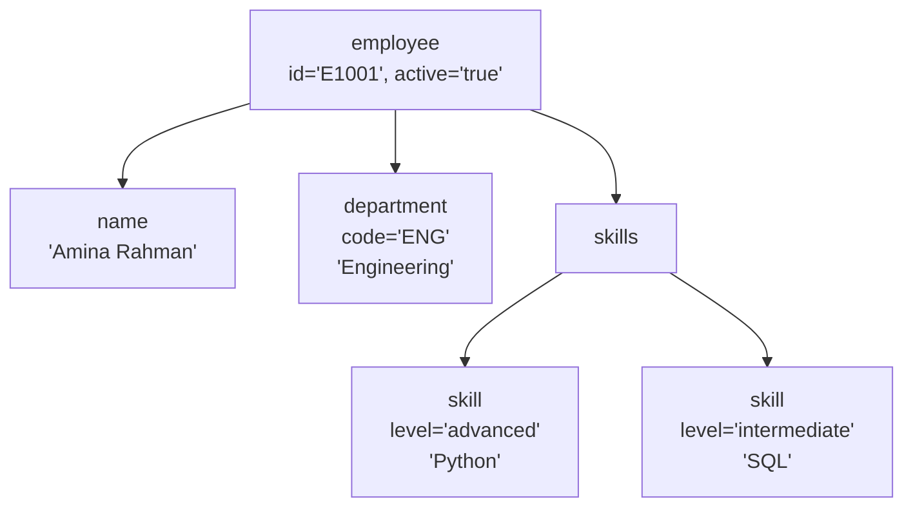
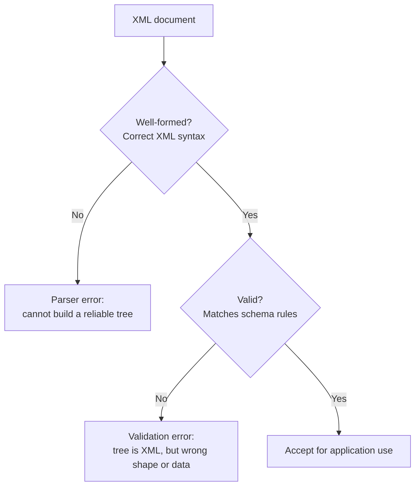
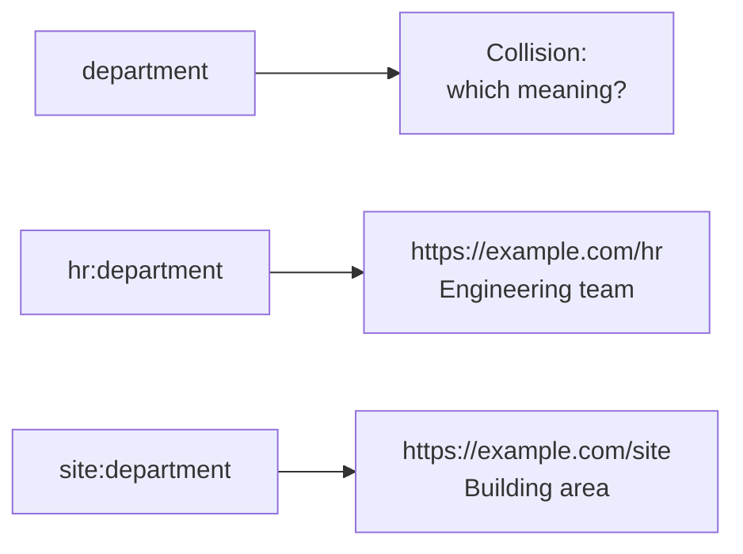
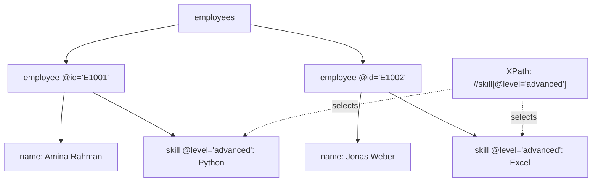
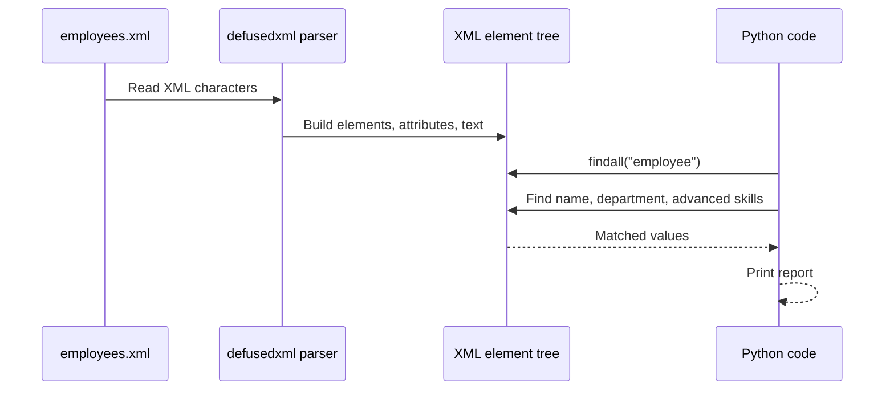
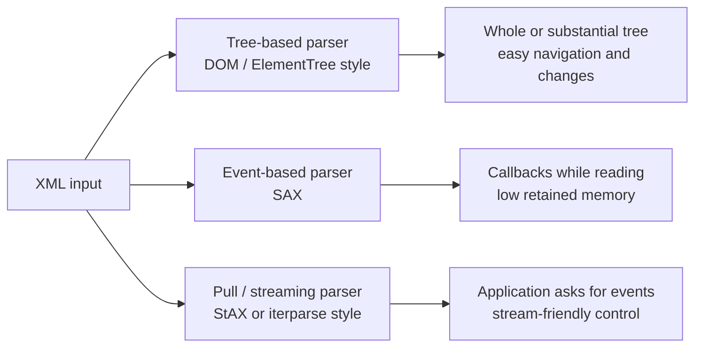
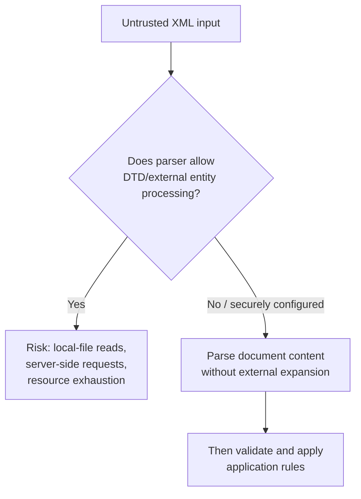
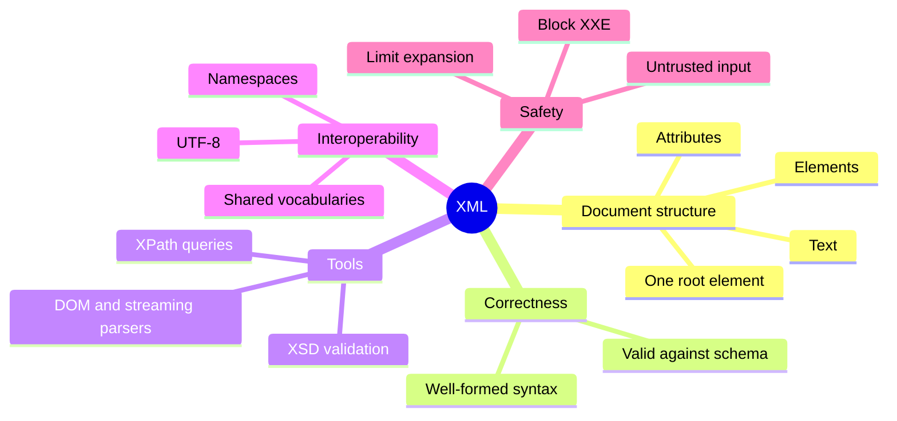

## XML

XML stands for **Extensible Markup Language**. It is a text-based format for representing structured information.

Unlike HTML, XML does not give you a fixed list of tags such as `<p>` or `<table>`. You define tags that describe the information in your own domain:

```xml
<employee id="E1001">
  <name>Amina Rahman</name>
  <department>Engineering</department>
</employee>
```

Here, `<employee>`, `<name>`, and `<department>` are not built-in XML instructions. They are names chosen by the document author.

A useful mental model is:

> XML stores data as a labeled tree. Elements create the branches, text holds values, attributes add small pieces of information, and optional schemas define which shapes are acceptable.

XML is still important in document formats, SOAP services, configuration files, SVG, Office documents, data feeds, and industries that rely on formal validation.

### Reading a small XML document

Start with a realistic but compact example:

```xml
<?xml version="1.0" encoding="UTF-8"?>
<employee id="E1001" active="true">
  <name>Amina Rahman</name>
  <department code="ENG">Engineering</department>
  <skills>
    <skill level="advanced">Python</skill>
    <skill level="intermediate">SQL</skill>
  </skills>
</employee>
```

Read it in plain English:

- The document describes one `employee`.
- The employee has an ID of `E1001` and is active.
- The employee's name is `Amina Rahman`.
- The department text is `Engineering`, with the code `ENG`.
- The employee has two skills, and each skill has a level.



That tree structure is central to XML. The same idea appears in XPath queries, DOM parsers, XSLT transformations, and XSD validation.

### Elements, attributes, and text

An XML document is built mainly from elements, attributes, and text values.

#### Elements

An element usually has an opening tag, content, and a closing tag:

```xml
<department>Engineering</department>
```

An element with no content can be written with an empty-element tag:

```xml
<middleName/>
```

Nested elements express structure:

```xml
<address>
  <city>Berlin</city>
  <country>Germany</country>
</address>
```

#### Attributes

Attributes appear inside the opening tag:

```xml
<employee id="E1001" active="true">
```

Attributes are often useful for identifiers, classifications, flags, or small metadata-like values. Elements are generally better when a value may repeat, contain nested structure, or be extended later.

For example:

```xml
<!-- Convenient for a short identifier -->
<employee id="E1001"/>

<!-- Better for repeating structured information -->
<employee>
  <phone type="mobile">+49 30 555 0101</phone>
  <phone type="work">+49 30 555 0102</phone>
</employee>
```

There is no universal rule that all “data” must be elements and all “metadata” must be attributes. Choose the representation that remains clear as the format grows.

#### Text content

Text lives between tags:

```xml
<name>Amina Rahman</name>
```

Some XML documents are mostly data, such as configuration or API messages. Others are documents containing mixed text and markup:

```xml
<paragraph>Please review the <emphasis>updated</emphasis> policy.</paragraph>
```

This ability to mix text and structure is one reason XML remains useful for publishing and document formats.

### XML syntax: what makes a document well-formed?

A document is **well-formed** when it follows XML's basic grammar. A parser cannot safely build the tree unless these rules are satisfied.

#### Core rules

| Rule | Correct | Incorrect |
|---|---|---|
| Exactly one root element | `<report><title>Q1</title></report>` | `<title>Q1</title><total>7</total>` |
| Tags are case-sensitive | `<name>Amina</name>` | `<Name>Amina</name>` |
| Elements must be properly nested | `<a><b/></a>` | `<a><b></a></b>` |
| Attribute values must be quoted | `<item id="7"/>` | `<item id=7/>` |
| A closing tag is required unless the tag is self-closing | `<status/>` | `<status>` |
| Reserved characters must be handled correctly | `<expr>3 &lt; 5 &amp; 7 &gt; 2</expr>` | `<expr>3 < 5 & 7 > 2</expr>` |

In normal character data, `<` and `&` must be escaped because they begin markup or an entity reference. The `>` character is usually allowed as text, although `&gt;` is often used for readability and the character sequence `]]>` cannot appear in ordinary character data.

### Common entity references

| Character | Write it as | Reason |
|---|---|---|
| `<` | `&lt;` | Avoids beginning a new tag |
| `>` | `&gt;` | Often clearer; required in some special contexts |
| `&` | `&amp;` | Avoids beginning an entity reference |
| `"` | `&quot;` | Needed when inside a double-quoted attribute value |
| `'` | `&apos;` | Needed when inside a single-quoted attribute value |

Example:

```xml
<rule expression="score &gt;= 80">
  Tom &amp; Amina passed because 3 &lt; 5.
</rule>
```

#### XML declaration

You will often see this first line:

```xml
<?xml version="1.0" encoding="UTF-8"?>
```

It identifies the XML version and the declared character encoding. It is a good convention for exchanged or stored documents, especially where encoding must be explicit. It is not mandatory in every XML 1.0 document; when it is present, it belongs at the beginning of the document.

### Well-formed is not the same as valid

A well-formed XML file obeys XML syntax. A **valid** XML file also follows a separate set of domain rules, usually described by a schema such as XSD or a DTD.

For example, this is well-formed XML:

```xml
<employee>
  <favouritePlanet>Mars</favouritePlanet>
</employee>
```

But it may be invalid for an employee system that requires an `id`, a `name`, and a `department`.



A short way to remember the distinction:

| Term | Question being asked |
|---|---|
| Well-formed | “Is this legal XML syntax?” |
| Valid | “Does this legal XML conform to the structure and data rules my application expects?” |

### Namespaces: avoiding name collisions

Different systems may reuse the same element names for different meanings. For example, an HR vocabulary and an office-location vocabulary could both define a `<department>` element.

A **namespace** qualifies names using a URI:

```xml
<?xml version="1.0" encoding="UTF-8"?>
<employee xmlns:hr="https://example.com/hr"
          xmlns:site="https://example.com/site"
          id="E1001">
  <name>Amina Rahman</name>
  <hr:department code="ENG">Engineering</hr:department>
  <site:department floor="4">Berlin Product Hub</site:department>
</employee>
```

The prefixes `hr` and `site` are convenient labels. The namespace URIs identify the vocabularies. They act as names; a parser does not need to visit those web addresses.



#### Namespace declarations

A prefixed namespace is declared like this:

```xml
xmlns:hr="https://example.com/hr"
```

A default namespace is declared like this:

```xml
xmlns="https://example.com/employees"
```

With a default namespace, unprefixed **element names** in its scope belong to that namespace:

```xml
<employee xmlns="https://example.com/employees">
  <name>Amina Rahman</name>
</employee>
```

A common surprise is that an unprefixed attribute does **not** automatically join the default namespace. In the example above, `employee` and `name` are in the default namespace, while an attribute such as `id="E1001"` remains unqualified unless it has its own prefix.

### XPath: finding information in the tree

XPath is a language for selecting nodes or calculating values from an XML tree.

Using this document:

```xml
<employees>
  <employee id="E1001">
    <name>Amina Rahman</name>
    <department>Engineering</department>
    <skills>
      <skill level="advanced">Python</skill>
      <skill level="intermediate">SQL</skill>
    </skills>
  </employee>
  <employee id="E1002">
    <name>Jonas Weber</name>
    <department>Finance</department>
    <skills>
      <skill level="advanced">Excel</skill>
    </skills>
  </employee>
</employees>
```

Some useful XPath expressions are:

| XPath | Meaning |
|---|---|
| `/employees/employee` | All `employee` children of the document root |
| `/employees/employee/name` | Each employee's `name` element |
| `//skill` | Every `skill` element anywhere below the current document |
| `//skill[@level='advanced']` | Skills whose `level` attribute is `advanced` |
| `/employees/employee[@id='E1002']/name/text()` | Text of the name for employee `E1002` |



Different libraries support different subsets or versions of XPath. Full XPath engines provide much more than simple path selection, including functions, comparisons, and expressions over values.

#### XPath with namespaces

When namespaces are used, queries must identify the namespace, not merely the visible prefix written in a source document.

For example:

```xml
<employees xmlns="https://example.com/employees">
  <employee id="E1001">
    <name>Amina Rahman</name>
  </employee>
</employees>
```

A namespace-aware Python query can assign its own convenient query prefix:

```python
namespaces = {"e": "https://example.com/employees"}
names = root.findall("e:employee/e:name", namespaces)
```

The prefix `e` in Python does not have to match a prefix in the original XML. The namespace URI is the important identity.

### A runnable Python example

The following example reads XML, selects data from the tree, and prints a small report. It uses `defusedxml`, which is a safer drop-in choice when XML may come from outside your trust boundary.

#### Step 1: Create `employees.xml`

```xml
<?xml version="1.0" encoding="UTF-8"?>
<employees>
  <employee id="E1001">
    <name>Amina Rahman</name>
    <department>Engineering</department>
    <skills>
      <skill level="advanced">Python</skill>
      <skill level="intermediate">SQL</skill>
    </skills>
  </employee>
  <employee id="E1002">
    <name>Jonas Weber</name>
    <department>Finance</department>
    <skills>
      <skill level="advanced">Excel</skill>
    </skills>
  </employee>
</employees>
```

#### Install the safe parser package

```bash
python -m pip install defusedxml
```

#### Create `read_employees.py`

```python
from defusedxml import ElementTree as ET
from xml.etree.ElementTree import Element


def load_employees(filename: str) -> Element:
    tree = ET.parse(filename)
    return tree.getroot()


def print_summary(root: Element) -> None:
    employees = root.findall("employee")
    print(f"Employees: {len(employees)}")

    for employee in employees:
        employee_id = employee.get("id", "unknown")
        name = employee.findtext("name", default="(no name)")
        department = employee.findtext("department", default="(no department)")
        advanced = [
            skill.text
            for skill in employee.findall("./skills/skill[@level='advanced']")
            if skill.text
        ]

        advanced_text = ", ".join(advanced) if advanced else "none"
        print(f"{employee_id}: {name} — {department} — advanced: {advanced_text}")


if __name__ == "__main__":
    root = load_employees("employees.xml")
    print_summary(root)
```

#### Run the program

```bash
python read_employees.py
```

Expected output

```text
Employees: 2
E1001: Amina Rahman — Engineering — advanced: Python
E1002: Jonas Weber — Finance — advanced: Excel
```

What the code is doing:



### DTD and XSD validation

Schemas let you state rules such as:

- which elements may appear;
- their required order;
- which attributes are allowed or required;
- whether a value must be an integer, date, Boolean, code, or patterned string.

#### DTD

A Document Type Definition is an older, compact schema language. It can describe element structure and attributes, but its datatype model and namespace support are limited.

A tiny DTD example:

```dtd
<!ELEMENT employee (name, department)>
<!ATTLIST employee id ID #REQUIRED>
<!ELEMENT name (#PCDATA)>
<!ELEMENT department (#PCDATA)>
```

#### XSD

XML Schema Definition, commonly called XSD, is itself XML and supports typed values, namespaces, restrictions, and reusable complex structures.

Here is a small schema for a single employee:

```xml
<?xml version="1.0" encoding="UTF-8"?>
<xs:schema xmlns:xs="http://www.w3.org/2001/XMLSchema">
  <xs:element name="employee">
    <xs:complexType>
      <xs:sequence>
        <xs:element name="name" type="xs:string"/>
        <xs:element name="department" type="xs:string"/>
        <xs:element name="startYear" type="xs:positiveInteger"/>
      </xs:sequence>
      <xs:attribute name="id" type="xs:string" use="required"/>
    </xs:complexType>
  </xs:element>
</xs:schema>
```

Valid instance:

```xml
<employee id="E1001">
  <name>Amina Rahman</name>
  <department>Engineering</department>
  <startYear>2022</startYear>
</employee>
```

Invalid instance:

```xml
<employee>
  <department>Engineering</department>
  <name>Amina Rahman</name>
  <startYear>not-a-year</startYear>
</employee>
```

The invalid example has no required `id`, places the elements in the wrong sequence, and supplies text where the schema expects a positive integer.

| Feature | DTD | XSD |
|---|---|---|
| Written in XML syntax | No | Yes |
| Built-in datatype range | Limited | Rich, including numbers and dates |
| Namespace-aware schema design | Limited | Yes |
| Good fit for simple legacy document rules | Often | Possible |
| Good fit for typed enterprise interchange | Limited | Usually stronger |

Validation is separate from safe parsing. A schema can reject an incorrectly shaped document, but parser security controls are still needed when input is untrusted.

### DOM, SAX, and streaming approaches

XML can be processed in more than one way. The right approach depends mainly on document size and whether your program needs random access to the entire tree.



| Approach | Main idea | Strengths | Trade-off |
|---|---|---|---|
| DOM / tree model | Load the document as nodes in a tree | Easy navigation, edits, repeated queries | Memory grows with document/tree size |
| SAX | Parser pushes events such as “start element” and “text” | Good for very large sequential processing | Callback-based code can be harder to organize |
| StAX / pull parsing | Application requests the next parsing event | Streaming with more application control | Not as convenient for arbitrary backward navigation |
| Python `iterparse` style | Iterate as elements finish parsing | Useful for large files and extraction tasks | Code must discard processed subtrees carefully |

Do not assume a streaming API automatically uses “constant memory” in every program. Memory stays low only if the application avoids retaining the whole parsed result.

### Security: do not parse untrusted XML casually

XML has features that can be dangerous when enabled on attacker-controlled input. The best-known example is **XML External Entity (XXE)** processing.

A malicious document may attempt to define an entity that points to a local file or network address:

```xml
<?xml version="1.0"?>
<!DOCTYPE data [
  <!ENTITY secret SYSTEM "file:///sensitive/local/file">
]>
<data>&secret;</data>
```

If a weakly configured parser resolves that external entity, it may disclose local data or make requests from the server's network position.

Another risk is excessive entity expansion, sometimes called a **Billion Laughs** attack, in which a small input expands dramatically and consumes resources.



#### Defensive guidance

- Treat uploaded, network-provided, and partner-provided XML as untrusted unless your trust boundary explicitly says otherwise.
- Disable DTD processing and external entity resolution unless a reviewed, tightly controlled use case genuinely requires them.
- Apply document-size and processing limits where XML input may be large.
- In Python, use a hardened approach such as `defusedxml` for untrusted XML parsing.
- In Java and other ecosystems, configure the specific parser factory securely; security settings vary by API and parser type.
- Validate expected structure and values after secure parsing.

Safe parsing and schema validation solve different problems:

| Concern | Mitigation |
|---|---|
| Parser retrieves external resources | Disable external entities / DTD resolution or use a hardened parser |
| Input expands into excessive data | Disable risky expansions and apply resource limits |
| Missing or incorrectly typed fields | Validate against XSD or application rules |
| Unexpected business values | Apply domain validation in application code |

### XML compared with JSON and Protobuf

No format is automatically better in every situation.

| Question | XML | JSON | Protobuf binary |
|---|---|---|---|
| Human-readable text format | Yes | Yes | No |
| Handles rich document-style mixed content well | Yes | Less naturally | Not its main purpose |
| Built-in namespace ecosystem | Yes | No standard equivalent | Schema packages instead |
| Mature schema validation standards | DTD, XSD, others | JSON Schema ecosystem | `.proto` schema |
| Compact over the wire | Often verbose | Usually less verbose than XML | Usually compact |
| Convenient for browser/API payloads | Used, but less common for new simple APIs | Very common | Requires generated/runtime support |
| Common strength | Documents, validation-heavy interchange, legacy/enterprise integration | Straightforward web data interchange | Typed compact service messages |

Choose XML when document structure, namespaces, transformation, or formal schema validation are important. Choose JSON when simple human-readable web interchange is the main need. Choose Protobuf when compact typed binary messages and schema-controlled service communication matter.

### Practical design guidelines

1. **Choose meaningful element names.** A reader should understand `<invoiceTotal>` more readily than `<value3>`.
2. **Keep structure predictable.** Consistent nesting makes code, validation, and XPath queries easier.
3. **Use attributes deliberately.** They work well for short identifiers and flags; prefer elements for repeating or structured information.
4. **Declare namespaces consistently.** Keep vocabulary identities stable and avoid changing prefix meanings within a document unless necessary.
5. **Specify character encoding when exchanging files.** UTF-8 is a practical default for interoperable text documents.
6. **Validate when a document is a contract.** XSD is useful when consumers depend on required elements, order, or datatypes.
7. **Parse untrusted XML securely.** Schema validation is not a substitute for disabling dangerous parser features.
8. **Use streaming for very large documents.** Avoid building an enormous in-memory tree when you only need a few values.
9. **Version published vocabularies carefully.** Consumers may depend on element names, namespace URIs, and schema rules.
10. **Test examples with real parsers.** A small sample XML file and expected output make a format easier to adopt correctly.

### Quick recap



The most important ideas are:

- XML is a text format that represents information as a tree.
- Well-formed XML follows the syntax rules; valid XML also satisfies a schema or formal contract.
- Namespaces distinguish vocabularies that might otherwise reuse the same names.
- XPath selects nodes from the tree.
- XSD can validate typed and structured interchange documents.
- Tree parsing is convenient, while streaming is preferable for very large input.
- Secure parser configuration is essential whenever XML may be attacker-controlled.

### Further reading

These notes are based on the following primary and security-focused references:

- [W3C: Extensible Markup Language (XML) 1.0, Fifth Edition](https://www.w3.org/TR/xml/)
- [W3C: Namespaces in XML 1.0, Third Edition](https://www.w3.org/TR/xml-names/)
- [W3C: XML Schema Definition Language (XSD) 1.1](https://www.w3.org/TR/xmlschema11-1/)
- [W3C: XML Path Language (XPath) 3.1](https://www.w3.org/TR/xpath-31/)
- [Python documentation: ElementTree XML API](https://docs.python.org/3/library/xml.etree.elementtree.html)
- [OWASP: XML External Entity Prevention Cheat Sheet](https://cheatsheetseries.owasp.org/cheatsheets/XML_External_Entity_Prevention_Cheat_Sheet.html)
