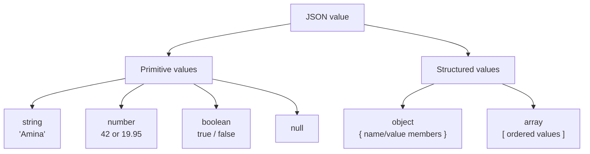
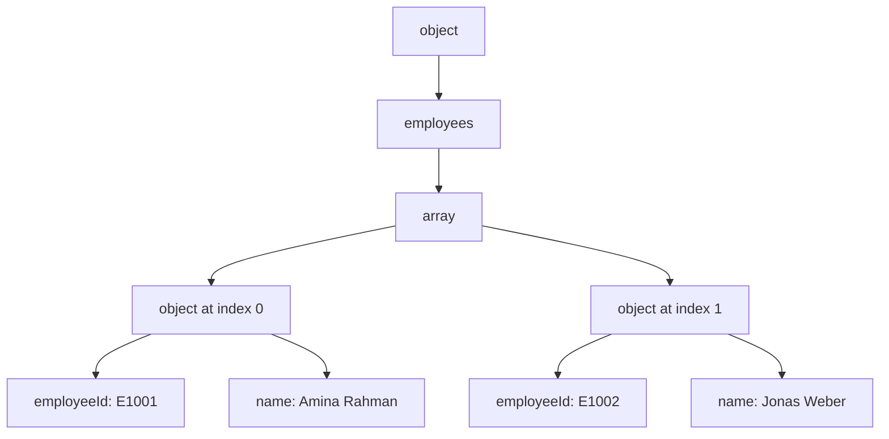
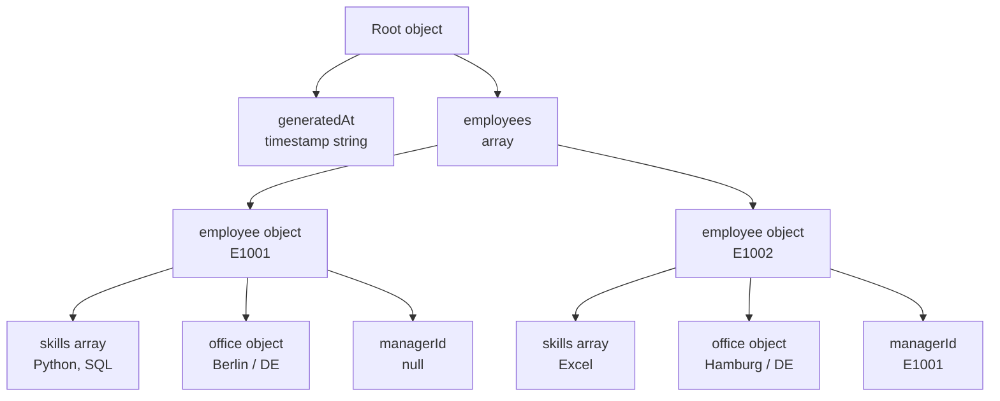
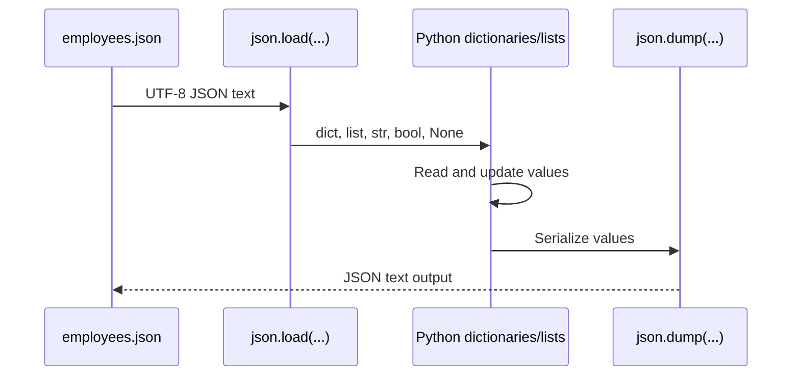
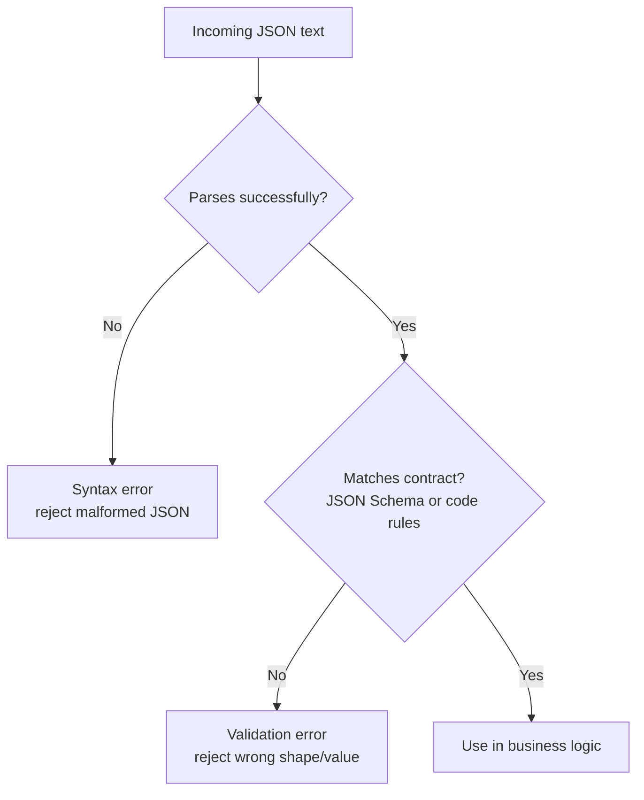
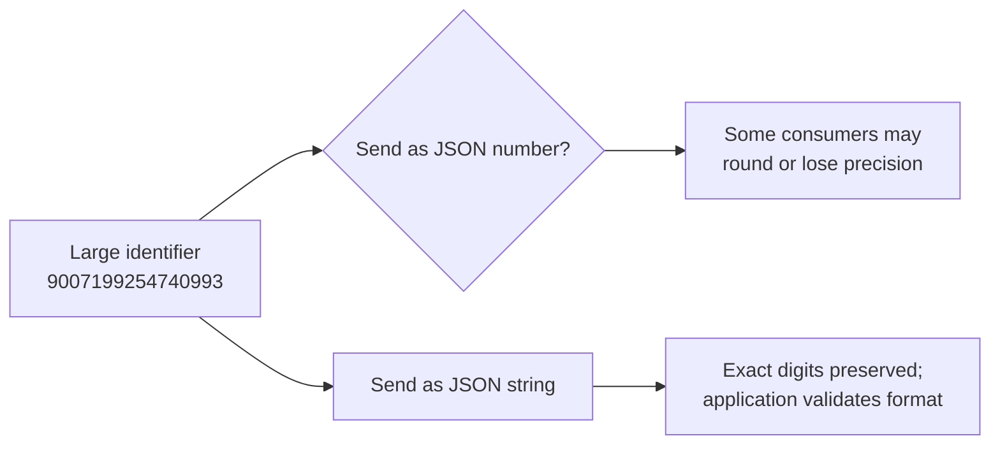
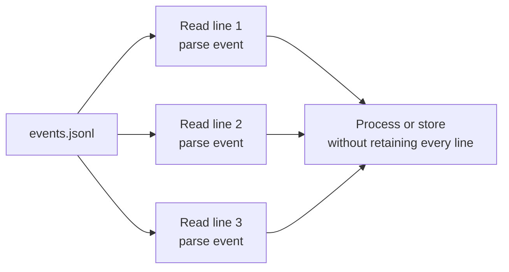
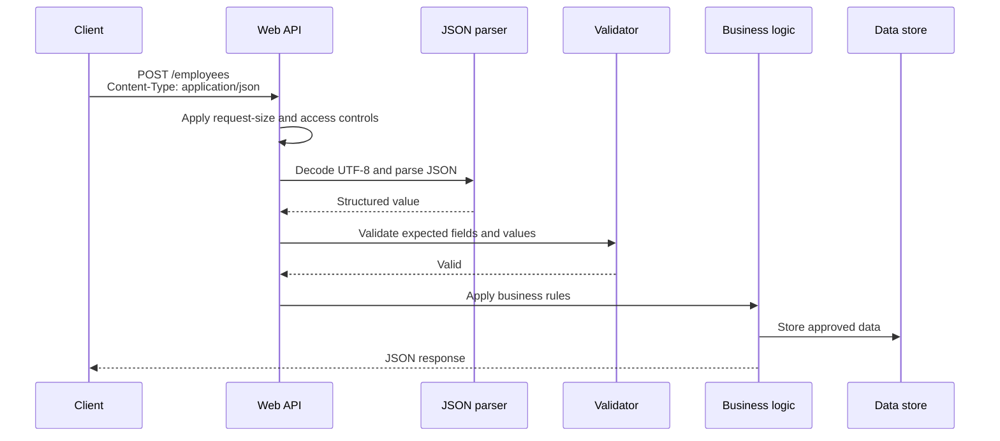
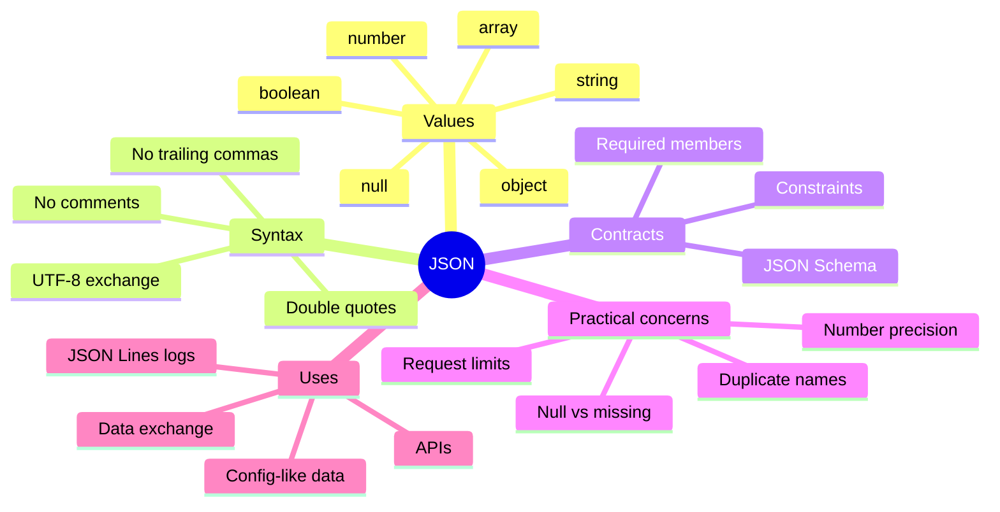

## JSON
JSON stands for **JavaScript Object Notation**. It is a small, text-based format for representing values so that programs can exchange them easily.

A JSON document can describe an employee, a list of orders, API settings, event logs, or almost any other structured information:

```json
{
  "employeeId": "E1001",
  "name": "Amina Rahman",
  "active": true,
  "skills": ["Python", "SQL"],
  "manager": null
}
```

A helpful mental model is:

> JSON represents values using objects, arrays, strings, numbers, booleans, and `null`. It gives data a portable structure, but it does not explain what fields mean or which fields are required unless a separate contract, such as JSON Schema, is provided.

JSON began as a notation related to JavaScript, but it is language-independent in everyday use. Python programs usually turn JSON objects into dictionaries, Java programs into mapped objects or tree nodes, JavaScript programs into native objects, and Go programs into structs or maps.

### The JSON value model

JSON supports four primitive kinds of value and two structured kinds of value.



| Value kind | Example | What it represents |
|---|---|---|
| String | `"Berlin"` | Text, enclosed in double quotation marks |
| Number | `42`, `-3.5`, `6.02e23` | A decimal number representation |
| Boolean | `true`, `false` | A truth value |
| Null | `null` | An explicitly empty or absent value |
| Object | `{"name": "Amina"}` | Named members, where each name is a string |
| Array | `["Python", "SQL"]` | An ordered sequence of values |

A complete JSON text may contain **any** JSON value at the top level:

```json
"ready"
```

```json
[1, 2, 3]
```

```json
{"status": "ready"}
```

Many APIs choose an object as the top-level value because named fields are easier to extend later, but the JSON format itself does not require this.

### Objects and arrays

### Objects: values identified by names

An object uses curly braces and contains name/value members:

```json
{
  "name": "Amina Rahman",
  "department": "Engineering",
  "active": true
}
```

The name is always a JSON string. A colon separates the name from its value, and commas separate members.

JSON object names **should be unique**. Avoid this:

```json
{
  "status": "pending",
  "status": "approved"
}
```

Different parsers may handle duplicate names differently: one may keep the final value, another may report an error, and another may preserve both internally. A reliable producer never sends duplicate object names.

Objects are conceptually collections of named values rather than ordered records. Many modern libraries preserve the input order when reading or writing objects, but interoperable application logic should not depend on the order of JSON object members unless an external protocol explicitly defines additional ordering rules.

#### Arrays: values identified by position

An array uses square brackets and contains zero or more values:

```json
["Python", "SQL", "Docker"]
```

Arrays are ordered. Position matters:

```json
["first", "second"]
```

is not the same sequence as:

```json
["second", "first"]
```

Array elements can themselves be objects or arrays:

```json
{
  "employees": [
    {
      "employeeId": "E1001",
      "name": "Amina Rahman"
    },
    {
      "employeeId": "E1002",
      "name": "Jonas Weber"
    }
  ]
}
```



### JSON syntax rules

JSON is intentionally small. Most JSON mistakes come from borrowing JavaScript or Python syntax that looks similar but is not JSON.

#### Correct document

```json
{
  "name": "Amina",
  "age": 30,
  "active": true,
  "projects": ["Atlas", "Orchid"],
  "manager": null
}
```

#### Rules to remember

| Rule | Correct JSON | Incorrect JSON |
|---|---|---|
| Names must be double-quoted strings | `{"name": "Amina"}` | `{name: "Amina"}` |
| Strings use double quotes | `{"city": "Berlin"}` | `{"city": 'Berlin'}` |
| No trailing comma | `{"a": 1, "b": 2}` | `{"a": 1, "b": 2,}` |
| Literal names are lowercase | `{"active": true}` | `{"active": True}` |
| `null` is the JSON null value | `{"manager": null}` | `{"manager": None}` |
| Comments are not part of JSON | `{"port": 8080}` | `{"port": 8080 /* dev */}` |
| Numbers cannot be `NaN` or infinity in standard JSON | `{"score": 1.5}` | `{"score": NaN}` |
| Leading zeroes are not allowed on integers | `{"month": 7}` | `{"month": 07}` |

#### JSON is not a JavaScript object literal

This JavaScript-like text is **not** valid JSON:

```javascript
{
  employeeId: 'E1001',
  active: true,
  score: NaN,
}
```

The valid JSON equivalent is:

```json
{
  "employeeId": "E1001",
  "active": true,
  "score": null
}
```

Whether `null` is the correct replacement for a missing score is an application decision; the key point is that `NaN` is not a standard JSON number.

### Strings, escaping, and Unicode

A JSON string is wrapped in double quotation marks:

```json
"Hello, world"
```

Characters with a special role can be escaped with a backslash:

| Desired character | JSON form | Example |
|---|---|---|
| Double quote | `\"` | `"She said \"hello\"."` |
| Backslash | `\\` | `"C:\\Users\\Amina"` |
| New line | `\n` | `"line one\nline two"` |
| Tab | `\t` | `"name\tvalue"` |
| Unicode escape | `\uXXXX` | `"\u20AC"` for `€` |

JSON text exchanged between independent systems should be UTF-8 encoded. Unicode characters can usually be written directly in UTF-8:

```json
{
  "city": "München",
  "currency": "€",
  "greeting": "こんにちは",
  "status": "✅"
}
```

They can also be escaped:

```json
{
  "currency": "\u20AC"
}
```

For characters outside the Basic Multilingual Plane, an escaped form uses a surrogate pair, but direct UTF-8 is often clearer:

```json
{
  "emojiDirect": "😀",
  "emojiEscaped": "\uD83D\uDE00"
}
```

Both are intended to represent the same Unicode character.

### A realistic JSON example

Create a file named `employees.json`:

```json
{
  "generatedAt": "2026-05-24T09:30:00Z",
  "employees": [
    {
      "employeeId": "E1001",
      "name": "Amina Rahman",
      "active": true,
      "department": "Engineering",
      "skills": ["Python", "SQL"],
      "office": {
        "city": "Berlin",
        "countryCode": "DE"
      },
      "managerId": null
    },
    {
      "employeeId": "E1002",
      "name": "Jonas Weber",
      "active": false,
      "department": "Finance",
      "skills": ["Excel"],
      "office": {
        "city": "Hamburg",
        "countryCode": "DE"
      },
      "managerId": "E1001"
    }
  ]
}
```

Reading it in ordinary language:

- The document was generated at a particular UTC timestamp.
- The `employees` value is an array containing two employee objects.
- Each employee has an identifier, name, active state, department, skills, and office.
- `managerId: null` means Amina has no manager value in this document.
- Jonas has a manager whose identifier is `E1001`.



### Parsing and serializing JSON in Python

**Parsing** converts JSON text into values a program can work with. **Serializing** converts program values back into JSON text.



Create `read_employees.py` in the same directory as `employees.json`:

```python
import json
from pathlib import Path
from typing import Any


def load_json_object(filename: str) -> dict[str, Any]:
    with Path(filename).open("r", encoding="utf-8") as file:
        value = json.load(file)

    if not isinstance(value, dict):
        raise ValueError("Expected the top-level JSON value to be an object.")

    return value


def print_active_employees(document: dict[str, Any]) -> None:
    employees = document.get("employees", [])
    active_employees = [
        employee for employee in employees if employee.get("active") is True
    ]

    print(f"Employees total: {len(employees)}")
    print(f"Active employees: {len(active_employees)}")

    for employee in active_employees:
        skills = ", ".join(employee.get("skills", []))
        city = employee["office"]["city"]
        print(f"- {employee['employeeId']}: {employee['name']} ({city}) — {skills}")


def write_pretty_copy(document: dict[str, Any], filename: str) -> None:
    with Path(filename).open("w", encoding="utf-8") as file:
        json.dump(document, file, indent=2, ensure_ascii=False)
        file.write("\n")


if __name__ == "__main__":
    employees_document = load_json_object("employees.json")
    print_active_employees(employees_document)
    write_pretty_copy(employees_document, "employees.pretty.json")
    print("Wrote employees.pretty.json")
```

Run it:

```bash
python read_employees.py
```

Expected output:

```text
Employees total: 2
Active employees: 1
- E1001: Amina Rahman (Berlin) — Python, SQL
Wrote employees.pretty.json
```

Important details in this example:

- `encoding="utf-8"` makes text encoding explicit.
- `json.load(file)` parses one JSON value from a file.
- JSON objects become Python dictionaries; arrays become lists.
- JSON `true`, `false`, and `null` become Python `True`, `False`, and `None`.
- `ensure_ascii=False` lets readable Unicode characters such as `ü` remain visible when writing UTF-8 JSON.
- `indent=2` creates human-readable output rather than the most compact output.

### Parsing is not validation

A parser checks whether input is syntactically valid JSON. It does not automatically know whether your application permits that structure.

This is syntactically valid JSON:

```json
{
  "employees": "not really a list"
}
```

It is not valid for an application that requires `employees` to be an array of employee objects.



A robust API typically separates these concerns:

1. Decode the request using UTF-8 and parse JSON.
2. Validate the expected shape, value types, and allowed constraints.
3. Apply authentication, authorization, and business rules.
4. Store data or perform actions only after those checks succeed.

### JSON Schema: describing the expected contract

JSON Schema is a vocabulary for describing JSON documents and validating instances against defined rules.

For the employee data, create `employees.schema.json`:

```json
{
  "$schema": "https://json-schema.org/draft/2020-12/schema",
  "$id": "https://example.com/schemas/employees.schema.json",
  "title": "Employee collection",
  "type": "object",
  "properties": {
    "generatedAt": {
      "type": "string",
      "format": "date-time"
    },
    "employees": {
      "type": "array",
      "items": {
        "$ref": "#/$defs/employee"
      }
    }
  },
  "required": ["generatedAt", "employees"],
  "additionalProperties": false,
  "$defs": {
    "employee": {
      "type": "object",
      "properties": {
        "employeeId": {
          "type": "string",
          "pattern": "^E[0-9]{4}$"
        },
        "name": {
          "type": "string",
          "minLength": 1
        },
        "active": {
          "type": "boolean"
        },
        "department": {
          "type": "string",
          "minLength": 1
        },
        "skills": {
          "type": "array",
          "items": {
            "type": "string",
            "minLength": 1
          },
          "uniqueItems": true
        },
        "office": {
          "$ref": "#/$defs/office"
        },
        "managerId": {
          "type": ["string", "null"],
          "pattern": "^E[0-9]{4}$"
        }
      },
      "required": [
        "employeeId",
        "name",
        "active",
        "department",
        "skills",
        "office",
        "managerId"
      ],
      "additionalProperties": false
    },
    "office": {
      "type": "object",
      "properties": {
        "city": {
          "type": "string",
          "minLength": 1
        },
        "countryCode": {
          "type": "string",
          "pattern": "^[A-Z]{2}$"
        }
      },
      "required": ["city", "countryCode"],
      "additionalProperties": false
    }
  }
}
```

#### Reading the schema

| Schema keyword | Meaning in this example |
|---|---|
| `$schema` | Says the schema uses the Draft 2020-12 vocabulary |
| `type` | Specifies the allowed JSON kind, such as object or array |
| `properties` | Defines known members of an object |
| `required` | Lists members that must be present |
| `items` | Specifies what values an array may contain |
| `$defs` | Holds reusable schema definitions |
| `$ref` | Reuses a definition instead of copying it |
| `pattern` | Requires a string to match a regular expression |
| `additionalProperties: false` | Rejects undeclared members at that object level |
| `uniqueItems: true` | Disallows duplicate array values according to schema equality |

The `format: "date-time"` keyword expresses that a string is intended to be a timestamp. Validation libraries may require explicit configuration before they enforce format checking, so do not assume every validator checks formats by default.

### Validating JSON with Python

Install a JSON Schema validation library:

```bash
python -m pip install jsonschema
```

Create an invalid file named `employees-invalid.json`:

```json
{
  "generatedAt": "2026-05-24T09:30:00Z",
  "employees": [
    {
      "employeeId": 1003,
      "name": "",
      "active": "yes",
      "department": "Engineering",
      "skills": ["Python", "Python"],
      "office": {
        "city": "Berlin",
        "countryCode": "Germany"
      },
      "managerId": null
    }
  ]
}
```

Now create `validate_employees.py`:

```python
import json
from pathlib import Path
from typing import Any

from jsonschema import Draft202012Validator, FormatChecker


def load_json(filename: str) -> Any:
    with Path(filename).open("r", encoding="utf-8") as file:
        return json.load(file)


def validate_file(instance_filename: str, schema: dict[str, Any]) -> bool:
    instance = load_json(instance_filename)
    validator = Draft202012Validator(schema, format_checker=FormatChecker())
    errors = sorted(validator.iter_errors(instance), key=lambda error: list(error.path))

    if not errors:
        print(f"{instance_filename}: valid")
        return True

    print(f"{instance_filename}: invalid")
    for error in errors:
        path = "$"
        for item in error.path:
            path += f"[{item}]" if isinstance(item, int) else f".{item}"
        print(f"  {path}: {error.message}")
    return False


if __name__ == "__main__":
    employee_schema = load_json("employees.schema.json")
    validate_file("employees.json", employee_schema)
    validate_file("employees-invalid.json", employee_schema)
```

Run it:

```bash
python validate_employees.py
```

Expected output may be phrased slightly differently between library versions, but it will identify problems similar to these:

```text
employees.json: valid
employees-invalid.json: invalid
  $.employees[0].active: 'yes' is not of type 'boolean'
  $.employees[0].employeeId: 1003 is not of type 'string'
  $.employees[0].name: '' should be non-empty
  $.employees[0].office.countryCode: 'Germany' does not match '^[A-Z]{2}$'
  $.employees[0].skills: ['Python', 'Python'] has non-unique elements
```

The valuable idea is not the exact punctuation of a validator's message. It is that malformed or incorrectly shaped input is rejected before application logic relies on it.

#### Null, missing values, and empty values

These are different states:

```json
{
  "managerId": null,
  "middleName": "",
  "skills": []
}
```

| Situation | Example | Possible meaning |
|---|---|---|
| Missing member | No `managerId` member at all | The producer did not provide the field, or the field is not applicable |
| Explicit null | `"managerId": null` | The field is known and has no current value |
| Empty string | `"middleName": ""` | A text field exists but has no characters |
| Empty array | `"skills": []` | The collection is present and currently has no items |

There is no universal rule that an API should always prefer `null` or always omit missing values. What matters is that the contract specifies the meaning, and producers and consumers follow it consistently.

A JSON Schema can express the difference:

```json
{
  "type": "object",
  "properties": {
    "managerId": {
      "type": ["string", "null"]
    }
  },
  "required": ["managerId"]
}
```

Here, `managerId` must be present, but its value may be a string or `null`.

### Numbers and precision

A JSON number is written in decimal form:

```json
{
  "count": 42,
  "ratio": 0.875,
  "distance": 1.2e6
}
```

The JSON grammar does not label values as `int32`, `int64`, `float`, or `decimal`. The receiving language or library chooses its own numeric representation.

This can matter when values are exchanged across languages:

```json
{
  "orderId": 9007199254740993
}
```

Some environments commonly represent numbers using IEEE 754 double-precision floating-point values. Such values cannot exactly represent every integer larger than `9007199254740991` (`2^53 - 1`). If a large identifier must survive across diverse systems exactly, representing it as a string is often safer:

```json
{
  "orderId": "9007199254740993"
}
```



#### Currency and decimal quantities

For prices or financial values, binary floating-point arithmetic can also introduce surprising rounding behavior. Depending on the application contract, common designs include:

```json
{
  "amountMinorUnits": 1299,
  "currency": "EUR"
}
```

or:

```json
{
  "amount": "12.99",
  "currency": "EUR"
}
```

The first uses integer minor units, such as cents. The second preserves a decimal string for explicit decimal processing. The right design depends on currency rules and the system's numeric libraries.

#### Non-standard numeric values

`NaN`, `Infinity`, and `-Infinity` are not valid standard JSON values. Some programming libraries may allow them by default when generating or accepting JSON-like text, so strict interoperability code should configure its serializer and parser accordingly.

For example, Python can be told to refuse non-standard floating-point output:

```python
import json

json.dumps({"score": float("nan")}, allow_nan=False)
```

This raises `ValueError` instead of writing a non-standard `NaN` token.

### Encoding binary data

JSON is a text format. It does not provide a native byte-array literal for arbitrary binary bytes such as a PDF fragment, an image, or an encryption nonce.

A common approach is to encode the bytes as Base64 text and clearly document that field:

```json
{
  "filename": "icon.png",
  "contentType": "image/png",
  "contentBase64": "iVBORw0KGgoAAAANSUhEUg..."
}
```

For large files, sending the file separately and putting only metadata or a link in JSON is frequently more efficient than embedding an expanded Base64 value inside a large JSON payload.

### JSON Lines / NDJSON for records and logs

A normal JSON array is a perfectly valid way to carry many records:

```json
[
  {"event": "login", "employeeId": "E1001"},
  {"event": "logout", "employeeId": "E1001"}
]
```

For logs, imports, and data pipelines, it is often useful to process one record at a time without surrounding the whole collection in one array. **JSON Lines**, also called **newline-delimited JSON** or **NDJSON**, writes one complete JSON value on each line:

```json
{"event":"login","employeeId":"E1001","at":"2026-05-24T09:30:00Z"}
{"event":"view_report","employeeId":"E1001","at":"2026-05-24T09:32:01Z"}
{"event":"logout","employeeId":"E1001","at":"2026-05-24T10:10:12Z"}
```

The typical file extension is `.jsonl`.



Three practical rules for JSON Lines:

1. Use UTF-8 encoding.
2. Each nonblank line must be a complete valid JSON value.
3. End records with a newline; including a newline after the final record is convenient for concatenation and pipeline tools.

JSON Lines is not required for all large-data use cases. Streaming parsers can process certain ordinary JSON structures incrementally as well. JSON Lines is popular because record boundaries are simple and appending another event is straightforward.

#### Python JSON Lines reading example

Given `events.jsonl`, a program can process line by line:

```python
import json
from pathlib import Path


with Path("events.jsonl").open("r", encoding="utf-8") as file:
    for line_number, line in enumerate(file, start=1):
        if not line.strip():
            raise ValueError(f"Blank line at {line_number} is not a JSON record.")

        event = json.loads(line)
        print(event["event"], event["employeeId"])
```

Expected output:

```text
login E1001
view_report E1001
logout E1001
```

### JSON in APIs: a request flow

JSON is common in HTTP APIs because it is straightforward to send, inspect, parse, and map into application data.



For input coming from users, browsers, partners, or mobile clients, consider JSON an untrusted boundary:

- set appropriate request-size limits;
- reject malformed JSON;
- validate the expected field types and permitted ranges;
- reject unexpected fields where your contract requires a closed shape;
- apply authentication and authorization independently of validation;
- avoid writing sensitive JSON values into logs without review;
- enforce output escaping when JSON values are later placed into HTML, SQL, shell commands, or other contexts.

Parsing JSON does not make its content safe to use in another language or system.

### Configuration files and comments

JSON is simple, but standard JSON deliberately has no comments:

```json
{
  "port": 8080
}
```

This is invalid standard JSON:

```json
{
  // Local development port
  "port": 8080
}
```

For machine-to-machine interchange, not having comments avoids uncertainty about whether comments must be retained or discarded. For human-maintained configuration, this limitation can be inconvenient.

Common choices are:

- use standard JSON when strict interoperability matters;
- use a documented JSON-compatible configuration format such as JSON5 only when every reader supports it;
- choose another configuration format if comments and human editing are important;
- include description fields only when they are real application data, not as an accidental substitute for a supported configuration format.

Do not silently send JSON5 features such as comments or trailing commas to a service expecting standard `application/json`.

### JSON compared with XML and Protocol Buffers

| Question | JSON | XML | Protobuf binary |
|---|---|---|---|
| Is it human-readable text? | Yes | Yes | Usually no |
| Does it have objects and arrays as direct value types? | Yes | Structure is represented with elements/attributes | Repeated and message fields through schema |
| Does it have a built-in namespace mechanism? | No | Yes | Names are organized through schema/package design |
| Is a schema required to parse the format? | No | No for well-formed parsing | Normally yes |
| Common validation approach | JSON Schema or application validation | XSD, DTD, or application validation | `.proto` schema plus application rules |
| Convenient for typical web APIs | Very common | Possible, less common for new simple APIs | Common when clients use generated code or gRPC |
| Compact for network transfer | Moderate; compressible text | Often verbose text | Usually compact binary |
| Strong fit | Readable API payloads and configuration-like data | Documents, namespaces, validation-heavy interchange | Typed compact service messages |

Choose JSON when straightforward, readable structured exchange matters. Choose XML when document markup, namespaces, or established XML ecosystems are central. Choose Protobuf when compact binary messages and schema-based generated code are valuable.

### Common mistakes and better approaches

| Mistake | Why it causes trouble | Better approach |
|---|---|---|
| Sending duplicate object names | Parsers may disagree about the retained value | Ensure each object name is unique |
| Depending on object member order | JSON object order is not a portable semantic contract | Use arrays when order carries meaning |
| Sending large identifiers as numbers | Some consumers may lose integer precision | Use validated strings for exact large IDs |
| Using `NaN` or `Infinity` | They are not standard JSON values | Use a documented alternative such as `null` or an explicit state |
| Treating parse success as business validation | Wrong types and unexpected values may still parse | Validate against a contract and business rules |
| Assuming `null`, missing, and empty mean the same thing | Consumers may behave differently | Define their semantics in the API contract |
| Allowing unlimited request bodies | Large payloads can consume resources | Enforce appropriate size limits |
| Putting binary content directly into strings without encoding rules | Consumers cannot reliably decode it | Use Base64 with explicit documentation or separate binary transfer |
| Hashing pretty-printed JSON directly for signatures | Whitespace and member serialization may differ | Use an agreed canonicalization/signing procedure |

### Practical design guidelines

1. **Use descriptive member names.** Prefer `"createdAt"` to ambiguous abbreviations such as `"ca"`.
2. **Keep member names consistent.** Select a naming convention such as `camelCase` or `snake_case` for a given API.
3. **Define a contract for published data.** JSON Schema and API documentation make required fields and constraints explicit.
4. **Model ordered data as arrays.** Do not use object member order to carry business meaning.
5. **Specify missing-versus-null behavior.** This is especially important for patch/update APIs and optional fields.
6. **Handle numbers intentionally.** Use strings or fixed-scale representations when exact cross-platform precision matters.
7. **Use UTF-8 for exchanged JSON.** It is the interoperable encoding required for JSON text exchanged outside a closed ecosystem.
8. **Apply limits and validation at trust boundaries.** A JSON parser is not a security policy.
9. **Avoid non-standard extensions unless explicitly agreed.** Comments, trailing commas, and special numeric tokens break strict JSON consumers.
10. **Use JSON Lines when record-by-record processing is the design goal.** It is especially convenient for event streams and logs.

### Quick recap



The essential ideas are:

- JSON is a text format for serializing values.
- It has four primitive value types and two structured value types.
- Objects carry named members; arrays carry ordered values.
- JSON syntax is stricter than a JavaScript object literal.
- Parsing checks syntax; validation checks whether data fits the application's contract.
- JSON Schema can describe and validate expected structure and constraints.
- Exact large numbers, `null` semantics, Unicode, and untrusted-input limits all deserve deliberate design.
- JSON Lines is a convenient record-by-record format for streams and logs.

### Further reading

These notes are aligned with the following primary and security-oriented references:

- [RFC 8259: The JavaScript Object Notation (JSON) Data Interchange Format](https://www.rfc-editor.org/rfc/rfc8259)
- [JSON Schema: Specification and Draft 2020-12](https://json-schema.org/specification)
- [JSON Schema: Getting Started Guide](https://json-schema.org/learn/getting-started-step-by-step)
- [Python Documentation: `json` Encoder and Decoder](https://docs.python.org/3/library/json.html)
- [JSON Lines Documentation](https://jsonlines.org/)
- [OWASP REST Security Cheat Sheet](https://cheatsheetseries.owasp.org/cheatsheets/REST_Security_Cheat_Sheet.html)
- [RFC 8785: JSON Canonicalization Scheme](https://www.rfc-editor.org/rfc/rfc8785)
