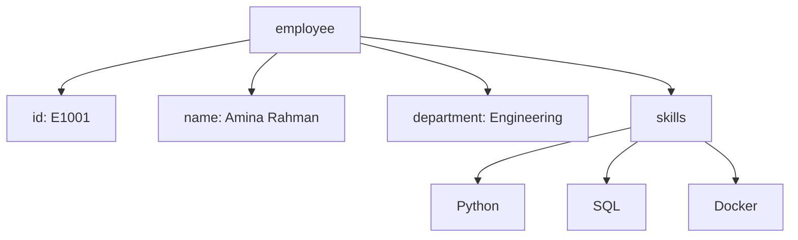
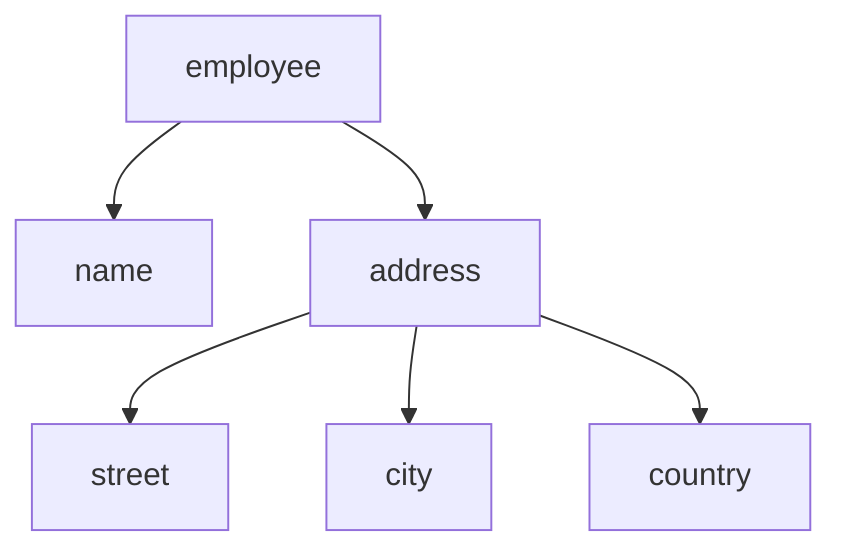
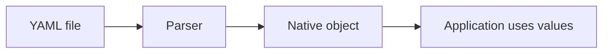
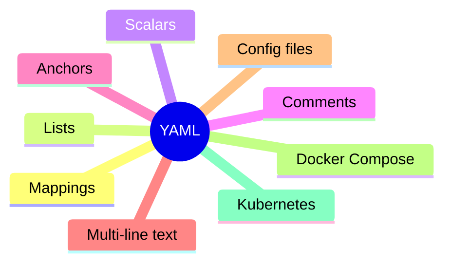

## YAML

YAML stands for **YAML Ain’t Markup Language**.

It is a **human-friendly data serialization format** commonly used for:

* configuration files
* infrastructure-as-code
* CI/CD pipelines
* Kubernetes manifests
* Docker Compose
* Ansible playbooks
* application settings

A useful way to think about YAML:

> YAML is designed for humans to write and read structured data with minimal syntax.

Compared to JSON, YAML is often easier to read because it relies on **indentation** instead of braces and commas.

### A simple YAML example

```yaml
employee:
  id: E1001
  name: Amina Rahman
  active: true
  department: Engineering
```

This means:

* `employee` is an object
* it contains fields:

  * `id`
  * `name`
  * `active`
  * `department`

#### JSON equivalent

```json
{
  "employee": {
    "id": "E1001",
    "name": "Amina Rahman",
    "active": true,
    "department": "Engineering"
  }
}
```

### YAML structure

YAML is built mainly from:

* mappings
* sequences
* scalars

#### Mapping (key-value pairs)

Like a dictionary / object:

```yaml
name: Amina
department: Engineering
active: true
```

#### Sequence (lists)

```yaml
skills:
  - Python
  - SQL
  - Docker
```

Equivalent JSON:

```json
{
  "skills": ["Python", "SQL", "Docker"]
}
```

#### Scalars (single values)

Examples:

```yaml
name: Amina
age: 30
active: true
salary: 50000.75
manager: null
```

Scalars can be:

* strings
* integers
* floats
* booleans
* null

### YAML visual structure



### Indentation matters

Indentation defines structure in YAML.

This is valid:

```yaml
employee:
  name: Amina
  department: Engineering
```

This is invalid:

```yaml
employee:
name: Amina
department: Engineering
```

YAML uses whitespace as syntax.

That means:

* tabs are discouraged
* spaces are preferred
* indentation must be consistent

Usually:

```text
2 spaces
```

or

```text
4 spaces
```

per nesting level.

### Nested objects

```yaml
employee:
  name: Amina
  address:
    street: 12 Main Street
    city: Berlin
    country: Germany
```

#### Tree view



### Lists of objects

Very common in YAML.

Example:

```yaml
employees:
  - id: E1001
    name: Amina
    department: Engineering

  - id: E1002
    name: Jonas
    department: Finance
```

Equivalent JSON:

```json
{
  "employees": [
    {
      "id": "E1001",
      "name": "Amina"
    },
    {
      "id": "E1002",
      "name": "Jonas"
    }
  ]
}
```

### Multi-line strings

YAML handles long text very well.

#### Literal block (`|`)

Preserves line breaks:

```yaml
message: |
  Hello team,
  Deployment completed successfully.
  Monitoring is active.
```

Output:

```text
Hello team,
Deployment completed successfully.
Monitoring is active.
```

#### Folded block (`>`)

Turns newlines into spaces.

```yaml
message: >
  Hello team,
  deployment completed successfully,
  monitoring is active.
```

Output:

```text
Hello team, deployment completed successfully, monitoring is active.
```

### Comments

Unlike JSON, YAML supports comments.

```yaml
# Application configuration
server:
  port: 8080
```

Comments are ignored by parsers.

### Anchors and aliases

A powerful YAML feature.

Useful when repeating values.

Example:

```yaml
defaults: &defaults
  timeout: 30
  retries: 5

serviceA:
  <<: *defaults
  url: api.example.com

serviceB:
  <<: *defaults
  url: auth.example.com
```

Expanded meaning

```yaml
serviceA:
  timeout: 30
  retries: 5
  url: api.example.com

serviceB:
  timeout: 30
  retries: 5
  url: auth.example.com
```

### Real-world example: Docker Compose

YAML is heavily used in Docker Compose.

Example:

```yaml
version: "3"

services:
  web:
    image: nginx
    ports:
      - "8080:80"

  db:
    image: postgres
    environment:
      POSTGRES_DB: app
      POSTGRES_USER: admin
```

### Real-world example: Kubernetes

YAML is the standard format for Kubernetes manifests.

Example:

```yaml
apiVersion: v1
kind: Pod

metadata:
  name: nginx-pod

spec:
  containers:
    - name: nginx
      image: nginx:latest
```

### YAML parsing flow



Example:

```yaml
port: 8080
debug: true
```

becomes:

Python:

```python
{
  "port": 8080,
  "debug": True
}
```

### Python example

Install parser:

```bash
pip install pyyaml
```

#### config.yaml

```yaml
app:
  name: Inventory Service
  port: 8080
  debug: true
```

#### read_config.py

```python
import yaml

with open("config.yaml", "r") as f:
    config = yaml.safe_load(f)

print(config["app"]["name"])
print(config["app"]["port"])
```

Expected output

```text
Inventory Service
8080
```

### Common pitfalls

#### Indentation errors

Very common.

Bad:

```yaml
app:
name: Inventory
```

Good:

```yaml
app:
  name: Inventory
```

#### Boolean surprises

YAML may auto-convert values.

Example:

```yaml
enabled: yes
```

might become:

```python
True
```

Safer:

```yaml
enabled: "yes"
```

if string intended.

#### Date parsing surprises

```yaml
date: 2025-05-24
```

may parse as a date object instead of string.

Safer:

```yaml
date: "2025-05-24"
```

#### Tabs vs spaces

Tabs can break parsing.

Always use spaces.

#### Unsafe loading

Avoid:

```python
yaml.load(...)
```

Prefer:

```python
yaml.safe_load(...)
```

### YAML vs JSON

| Feature              |        YAML |        JSON |
| -------------------- | ----------: | ----------: |
| Human readability    |   Excellent |        Good |
| Supports comments    |         Yes |          No |
| Uses indentation     |         Yes |          No |
| Uses braces/brackets |    Optional |    Required |
| Parsing complexity   |      Higher |       Lower |
| Common for configs   | Very common |      Common |
| Common for APIs      | Less common | Very common |

### Best practices

### Use consistent indentation

Prefer:

```text
2 spaces
```

#### Quote ambiguous strings

Example:

```yaml
version: "1.0"
```

#### Keep nesting shallow

Deep nesting becomes difficult to read.

#### Use comments carefully

Helpful for config files.

#### Use `safe_load`

Safer when parsing user-provided YAML.

### Quick recap



### When YAML is a great choice

Use YAML when:

* humans edit the file often
* readability matters
* configuration is complex
* comments are useful
* nested structures are common

Good examples:

* Kubernetes manifests
* GitHub Actions workflows
* Docker Compose
* Ansible

### When YAML is not ideal

Avoid YAML when:

* strict machine parsing simplicity matters
* performance is critical
* parser ambiguity is risky
* many tools must consume it identically

In those cases JSON may be simpler.
